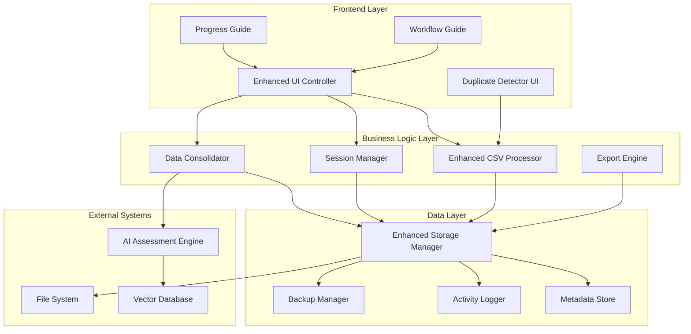

# Design Document: Personality Assessment System Improvements

## Overview

This design addresses critical usability and functionality improvements for the Personality Assessment System based on user feedback. The solution focuses on data consolidation, enhanced organization, user guidance, and robust error prevention while maintaining the existing AI-powered assessment capabilities.

The improvements are designed to be backward-compatible with existing data while providing significantly enhanced user experience and data management capabilities.

## Architecture

### Enhanced System Architecture



### Key Architectural Changes

1. **Data Consolidation Layer**: New `Data_Consolidator` component manages multi-observation aggregation
2. **Enhanced Storage**: Upgraded `Storage_Manager` with versioning, backup, and metadata tracking
3. **Session Management**: New `Session_Manager` handles auto-save, recovery, and workflow state
4. **Improved CSV Processing**: Enhanced validation, blank row handling, and error reporting
5. **User Guidance System**: Integrated workflow guides and progress indicators

## Components and Interfaces

### 1. Enhanced Data Consolidator

```python
class DataConsolidator:
    def consolidate_student_observations(self, student_id: str) -> ConsolidatedProfile
    def merge_observations(self, observations: List[Observation]) -> MergedObservation
    def get_observation_timeline(self, student_id: str) -> Timeline
    def calculate_assessment_weights(self, observations: List[Observation]) -> WeightMap
    def generate_consolidated_assessment(self, student_id: str) -> Assessment
```

**Key Features:**
- Temporal weighting of observations (recent observations have higher weight)
- Conflict resolution when observations contradict
- Metadata preservation from all source observations
- Configurable consolidation strategies

### 2. Enhanced Storage Manager

```python
class EnhancedStorageManager:
    def store_observation(self, observation: Observation) -> ObservationId
    def get_student_history(self, student_id: str) -> StudentHistory
    def create_backup(self, data: Any) -> BackupId
    def restore_from_backup(self, backup_id: BackupId) -> RestoreResult
    def log_activity(self, activity: Activity) -> None
    def get_school_summary(self, school_id: str) -> SchoolSummary
    def search_assessments(self, criteria: SearchCriteria) -> SearchResults
```

**Storage Schema Enhancements:**
- Individual observation storage with full metadata
- Student-level aggregation tables for quick access
- School-level summary tables for organization
- Activity logs for audit trails
- Backup versioning with automatic cleanup

### 3. Session Manager

```python
class SessionManager:
    def start_session(self, user_id: str) -> SessionId
    def auto_save_progress(self, session_id: SessionId, data: Any) -> None
    def recover_session(self, session_id: SessionId) -> SessionData
    def get_pending_tasks(self, session_id: SessionId) -> List[Task]
    def mark_task_complete(self, task_id: TaskId) -> None
    def send_reminder(self, session_id: SessionId, reminder_type: ReminderType) -> None
```

**Session Features:**
- Automatic progress saving every 30 seconds
- Browser session recovery after interruptions
- Pending task tracking and reminders
- Workflow state management
- Cross-tab synchronization

### 4. Enhanced CSV Processor

```python
class EnhancedCSVProcessor:
    def validate_csv(self, file_content: str) -> ValidationResult
    def process_csv(self, file_content: str) -> ProcessingResult
    def detect_duplicates(self, students: List[Student]) -> DuplicateReport
    def skip_blank_rows(self, rows: List[Row]) -> List[Row]
    def generate_validation_report(self, issues: List[Issue]) -> ValidationReport
```

**Processing Improvements:**
- Intelligent blank row detection (empty cells, whitespace-only)
- Comprehensive data validation with detailed error reporting
- Duplicate detection within files and across uploads
- Preview generation with accurate counts
- Configurable validation rules

### 5. Progress and Workflow Guide System

```python
class WorkflowGuide:
    def get_current_step(self, session_id: SessionId) -> WorkflowStep
    def get_next_actions(self, current_state: State) -> List[Action]
    def show_confirmation_dialog(self, action: Action) -> ConfirmationResult
    def provide_contextual_help(self, context: Context) -> HelpContent
    def track_user_progress(self, session_id: SessionId, step: Step) -> None
```

**Guidance Features:**
- Step-by-step workflow navigation
- Contextual help and tooltips
- Confirmation dialogs for destructive actions
- Progress tracking and completion indicators
- Adaptive guidance based on user behavior

## Data Models

### Enhanced Student Profile

```python
@dataclass
class StudentProfile:
    student_id: str
    name: str
    school: str
    class_name: str
    observations: List[Observation]
    consolidated_assessment: Optional[Assessment]
    metadata: StudentMetadata
    
@dataclass
class Observation:
    observation_id: str
    student_id: str
    content: str
    timestamp: datetime
    source: str
    assessor: str
    session_id: str
    
@dataclass
class StudentMetadata:
    first_observed: datetime
    last_observed: datetime
    observation_count: int
    assessment_count: int
    data_quality_score: float
```

### School Organization Structure

```python
@dataclass
class SchoolSummary:
    school_id: str
    school_name: str
    total_students: int
    total_classes: int
    assessment_date_range: DateRange
    completion_status: CompletionStatus
    last_activity: datetime
    
@dataclass
class ClassSummary:
    class_id: str
    class_name: str
    student_count: int
    assessed_count: int
    pending_approvals: int
    last_assessment: datetime
```

### Session and Activity Tracking

```python
@dataclass
class SessionData:
    session_id: str
    user_id: str
    start_time: datetime
    last_activity: datetime
    current_workflow: WorkflowState
    pending_tasks: List[Task]
    auto_save_data: Dict[str, Any]
    
@dataclass
class ActivityLog:
    activity_id: str
    session_id: str
    timestamp: datetime
    action_type: ActionType
    details: Dict[str, Any]
    affected_entities: List[str]
```

## Correctness Properties

*A property is a characteristic or behavior that should hold true across all valid executions of a system-essentially, a formal statement about what the system should do. Properties serve as the bridge between human-readable specifications and machine-verifiable correctness guarantees.*

### Property 1: Data Consolidation Consistency
*For any* student with multiple observations, consolidating and then re-consolidating should produce the same result
**Validates: Requirements 1.1, 1.3**

### Property 2: Observation Preservation
*For any* set of individual observations, the consolidated view should preserve all original observation metadata and content
**Validates: Requirements 1.4**

### Property 3: Count Accuracy
*For any* data display showing counts (students, observations, assessments), the displayed count should match the actual count of valid entries
**Validates: Requirements 2.2, 3.2, 8.3**

### Property 4: Search Result Consistency
*For any* search or filter criteria, applying the same criteria multiple times should return identical results
**Validates: Requirements 2.3**

### Property 5: Timestamp Monotonicity
*For any* sequence of observations added to the system, their timestamps should reflect the order of addition
**Validates: Requirements 3.1**

### Property 6: Progress Indicator Accuracy
*For any* long-running operation, the progress percentage should be monotonically increasing and reach 100% upon completion
**Validates: Requirements 4.2**

### Property 7: Duplicate Detection Completeness
*For any* set of uploaded files or student data, all actual duplicates should be detected and no false positives should occur
**Validates: Requirements 5.1, 5.3**

### Property 8: Workflow State Consistency
*For any* workflow session, the system state should always reflect the actual progress and allow valid next actions
**Validates: Requirements 6.3, 6.4**

### Property 9: Auto-save Reliability
*For any* active session, progress should be automatically saved at regular intervals and be recoverable after interruption
**Validates: Requirements 6.2, 10.1, 10.2**

### Property 10: CSV Processing Accuracy
*For any* valid CSV file, the number of processed students should equal the number of non-blank rows with valid data
**Validates: Requirements 8.1, 8.2**

### Property 11: Export Data Integrity
*For any* data export operation, the exported data should contain all requested information without loss or corruption
**Validates: Requirements 9.1, 9.2**

### Property 12: Backup Consistency
*For any* data modification, a backup should be created and the backup should contain the pre-modification state
**Validates: Requirements 10.3**

### Property 13: Reminder Timeliness
*For any* pending approval or incomplete task, reminders should be generated at appropriate intervals during active sessions
**Validates: Requirements 7.1, 7.5**

### Property 14: Validation Report Completeness
*For any* CSV processing operation with errors, the validation report should identify all issues with accurate row numbers and descriptions
**Validates: Requirements 8.4, 8.5**

### Property 15: Session Recovery Completeness
*For any* interrupted session, all recoverable work should be restored without data loss
**Validates: Requirements 10.2, 10.4**

## Error Handling

### Graceful Degradation Strategy

1. **Data Consolidation Failures**: Fall back to individual observation display with warning
2. **Auto-save Failures**: Provide manual save options and clear error notifications
3. **CSV Processing Errors**: Continue processing valid rows, report all errors with context
4. **Session Recovery Failures**: Offer partial recovery options and backup restoration
5. **Duplicate Detection Failures**: Allow manual duplicate resolution with user guidance

### Error Recovery Mechanisms

- **Automatic Retry**: For transient failures (network, temporary file locks)
- **User-Guided Recovery**: For data conflicts and ambiguous situations
- **Backup Restoration**: For data corruption or major system failures
- **Partial Operation Completion**: Continue processing what's possible, report what failed

## Testing Strategy

### Dual Testing Approach

The system will use both **unit tests** and **property-based tests** as complementary testing strategies:

- **Unit tests**: Verify specific examples, edge cases, and error conditions
- **Property tests**: Verify universal properties across all inputs
- Both are necessary for comprehensive coverage

### Property-Based Testing Configuration

- **Testing Framework**: Hypothesis (Python) for property-based testing
- **Minimum Iterations**: 100 iterations per property test
- **Test Tags**: Each property test tagged with format: **Feature: personality-assessment-improvements, Property {number}: {property_text}**

### Unit Testing Focus Areas

- **CSV parsing edge cases**: Empty files, malformed data, encoding issues
- **Data consolidation scenarios**: Conflicting observations, missing data
- **UI state transitions**: Workflow navigation, error states
- **Session management**: Recovery scenarios, timeout handling
- **Integration points**: AI engine integration, file system operations

### Property Testing Focus Areas

- **Data integrity properties**: Consolidation consistency, backup reliability
- **User interface properties**: Progress accuracy, count correctness
- **System behavior properties**: Auto-save reliability, duplicate detection
- **Performance properties**: Response time bounds, memory usage limits