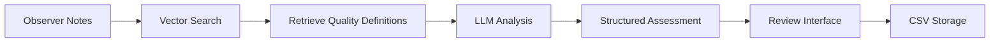

# 🎓 Personality Assessment System for Rural Students

A multi-agent RAG + LLM pipeline designed to assess personality traits of rural students based on observer notes. This system helps NGO workers efficiently classify students into 20 personality qualities with LOW, MIDDLE, or HIGH ratings.

## 🌟 Features

### Core Assessment
- **Multi-Agent RAG Pipeline**: Combines vector database search with LLM analysis
- **20 Personality Qualities**: Comprehensive assessment framework based on NGO observation data
- **Individual & Batch Assessment**: Process single students or multiple students at once
- **Review Interface**: Approve and edit predicted labels before finalizing

### Storage & Organization
- **Structured File Naming**: Batch assessments saved as `schoolname_class_date.csv`
- **Smart Filtering**: Browse stored assessments by School → Class → Date hierarchy
- **CSV-Only Storage**: All data stored in portable CSV format

### Report Generation
- **SWOT Analysis**: Generate Strengths, Weaknesses, Opportunities, Threats analysis
- **Marathi Support**: SWOT analysis available in Marathi for local use
- **Report Cards**: Generate Excel-based report cards with SWOT data

### System Features
- **Rate Limiting**: Built-in API rate limiting to prevent quota exceeded errors
- **Streamlit Interface**: Clean, simple web interface with organized tabs
- **PDF Integration**: Uses map-t.pdf for quality definitions

## 🎯 The 20 Personality Qualities

| # | Quality | Description |
|---|---------|-------------|
| 1 | Adaptability | Ability to adjust to new situations |
| 2 | Academic Achievement | Performance in academic tasks |
| 3 | Boldness | Confidence and courage in new situations |
| 4 | Competition | Drive to compete and win |
| 5 | Creativity | Imagination and innovative thinking |
| 6 | Enthusiasm | Energy and interest in activities |
| 7 | Excitability | Emotional responsiveness |
| 8 | General Ability | Overall cognitive skills |
| 9 | Guilt Proneness | Sense of responsibility and remorse |
| 10 | Individualism | Independent thinking and action |
| 11 | Innovation | Openness to new methods and approaches |
| 12 | Leadership | Ability to guide and influence others |
| 13 | Maturity | Emotional and behavioral maturity |
| 14 | Mental Health | Emotional stability and stress management |
| 15 | Morality | Ethical judgment and integrity |
| 16 | Self Control | Discipline and impulse control |
| 17 | Sensitivity | Emotional awareness and empathy |
| 18 | Self Sufficiency | Independence and self-reliance |
| 19 | Social Warmth | Friendliness and social interaction |
| 20 | Tension | Stress levels and anxiety |

## 🚀 Quick Start

### Prerequisites

- Python 3.8 or higher
- Google API key (for Gemini)
- `map-t.pdf` file (quality definitions)

### Installation

1. **Clone or download the project files**

2. **Create virtual environment (recommended):**
   ```bash
   python -m venv venv
   venv\Scripts\activate  # Windows
   ```

3. **Install dependencies:**
   ```bash
   pip install -r requirements.txt
   ```

4. **Set up your Google API key:**
   - Create a `.env` file in the project directory
   - Add: `GOOGLE_API_KEY=your_api_key_here`
   - Or enter it directly in the Streamlit app sidebar

### Running the Application

**Windows:** Double-click `run_app.bat`

**Manual:**
```bash
streamlit run frontend/streamlit_app.py
```

The application opens at `http://localhost:8501`

## 📱 Using the Application

### Tab 1: Individual Assessment
1. Enter **School Name** and **Class**
2. Enter **Student Name** and **Observer Notes**
3. Click "Assess Personality" to get results
4. View detailed breakdown by quality level
5. Results are saved as `studentname_schoolname_date.csv`

### Tab 2: Batch Assessment
1. Enter **School Name** and **Class** (required)
2. Upload a CSV file with columns: `Name`, `Observations`
3. Click "Start Batch Assessment"
4. Review predicted labels in the data editor
5. Tick "Approved" checkbox for each row
6. Click "Finalize & Download CSV"
7. Results saved as `schoolname_class_date.csv`

### Tab 3: Stored Assessments
1. View summary: total schools, classes, and files
2. **Filter by School** → **Class** → **Date**
3. View and download stored assessment data

### Tab 4: SWOT & Report Cards
1. **Individual Analysis**: Generate SWOT in English or Marathi
2. **Batch Analysis**: Upload CSV for multiple students
3. **Report Cards**: Generate Excel report cards with Marathi SWOT

## 📊 Assessment Output

| Level | Icon | Description |
|-------|------|-------------|
| HIGH | 🟢 | Student clearly demonstrates this quality |
| MIDDLE | 🟡 | Student shows moderate evidence |
| LOW | 🔴 | Student shows limited evidence |
| NOT OBSERVED | ⚪ | Insufficient evidence |

## 📁 Project Structure

```
service learning/
├── frontend/
│   └── streamlit_app.py           # Main Streamlit application
├── ai_core/
│   ├── __init__.py
│   ├── personality_assessment.py   # Core assessment + SWOT engine
│   ├── csv_reference_processor.py  # Reference data processor
│   ├── assessment_storage_manager.py # Data storage management
│   └── report_card_generator.py    # Excel report card generator
├── backend/
│   ├── __init__.py
│   └── rate_limiter.py             # API rate limiting
├── assessments/                    # Generated assessment files
│   └── [school]_[class]_[date].csv # Batch assessment results
├── config.py                       # Configuration settings
├── requirements.txt                # Python dependencies
├── run_app.bat                     # Windows startup script
├── map-t.pdf                       # Quality definitions (required)
├── report_card_template.xlsx       # Report card Excel template
├── reference_sheet_template.csv    # Template for observations
├── Observations...csv              # NGO reference data
└── README.md                       # This file
```

## 🔧 Technical Details

### Architecture
- **Vector Database**: ChromaDB with HuggingFace embeddings (All-MiniLM-L6-v2)
- **LLM**: Google Gemini 1.5 Flash (optimized for rate limits)
- **RAG Pipeline**: Retrieves relevant context from PDF and CSV reference data
- **Rate Limiting**: Built-in delays and retry logic

### Data Flow


### Performance
- **Individual Assessment**: ~30-60 seconds per student
- **Batch Processing**: Sequential processing with progress bar
- **Vector Database**: Fast semantic search across reference materials

## 🚦 Rate Limiting

The system includes built-in rate limiting:

| Limit | Default |
|-------|---------|
| Per Minute | 15 requests |
| Per Day | 1000 requests |
| Delay Between Calls | 2 seconds |

**Tips for Free Tier:**
- Wait 1-2 minutes between assessments
- Use batch processing for multiple students
- Monitor rate limit status in sidebar

## 🛠️ Customization

### Adding New Qualities
Edit `PERSONALITY_QUALITIES` in `config.py`

### Modifying Assessment Prompts
Update prompt templates in `ai_core/personality_assessment.py`

### Changing LLM Model
Modify model configuration in `PersonalityAssessmentSystem.__init__()`

## 🚨 Troubleshooting

| Issue | Solution |
|-------|----------|
| "System not initialized" | Check API key, ensure `map-t.pdf` exists |
| "Assessment failed" | Verify API key, check internet connection |
| "Rate limit exceeded (429)" | Wait 1-2 minutes, check sidebar status |
| "Vector database error" | Delete `chroma_db` folder, reinitialize |

## 📄 License

This project is designed for educational and NGO use. Please ensure compliance with local data protection regulations when handling student information.

---

**Built with ❤️ for rural education development**
